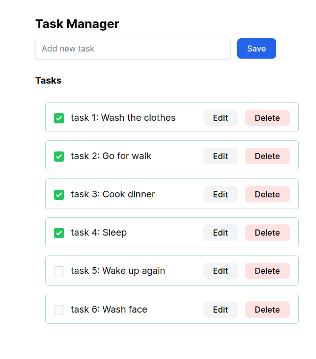

# Description
This todo app is built with Ruby on Rails and utilizes Hotwire to enhance its dynamic features. Hotwire enables you to create a more interactive user experience by updating the content of your app without requiring full-page reloads. This can include features like adding or editing tasks, marking them as complete, all without refreshing the entire page. By leveraging Hotwire in your Rails app, you're able to make it more responsive and user-friendly.

Sure, let's break down each of these components:

Turbo Drive: Turbo Drive is a part of Hotwire, which is a set of tools by Basecamp for building modern web applications with Ruby on Rails. Turbo Drive enables seamless navigation between pages in your Rails application without full-page reloads. When a user clicks a link, Turbo Drive intercepts the request and fetches the new page's content via AJAX. It then replaces the current page's body with the new content, updating the browser's URL and history state as needed. This approach can make your application feel faster and more responsive to users.

Stimulus: Stimulus is another part of Hotwire that focuses on enhancing the interactivity of your Rails views. It's a JavaScript framework that helps you manage and enhance the behavior of individual elements on a page. Stimulus encourages a "sprinkles" approach to JavaScript, where you add small amounts of behavior to your HTML elements to make them more dynamic. It's particularly useful for adding client-side interactions that don't require complex state management or full-blown JavaScript frameworks.

Turbo Frame: Turbo Frame is a specific feature of Turbo Drive that allows you to selectively update parts of a page instead of the entire page. You can define a frame using an HTML <turbo-frame> tag and give it an id. When a Turbo Drive request returns content that includes a turbo-frame with a matching id, Turbo Drive will replace the frame's content with the new content. This can be useful for updating specific parts of a page, such as a sidebar or a form, without refreshing the entire page.

In summary, Turbo Drive, Stimulus, and Turbo Frame are all components of Hotwire that work together to enhance the interactivity and responsiveness of your Ruby on Rails application, making it feel more like a modern single-page application while still leveraging the power and simplicity of Rails.

# Overview

